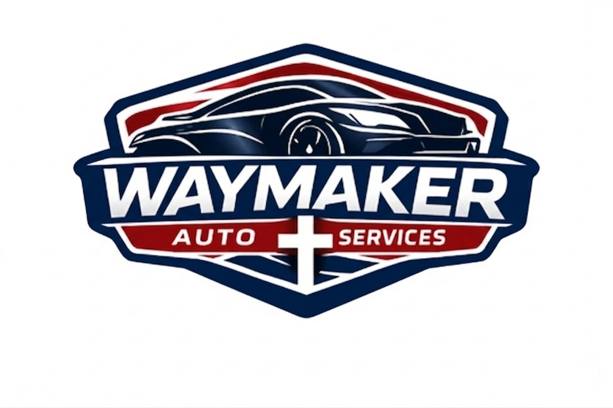

[index (16).html](https://github.com/user-attachments/files/27978325/index.16.html)
# my-website<!DOCTYPE html>
<html lang="en">
<head>
  <meta charset="UTF-8" />
  <meta name="viewport" content="width=device-width, initial-scale=1.0" />
  <title>Waymaker Auto Services LLC</title>
  <link rel="icon" type="image/x-icon" href="waymaker_favicon.ico" />
  <link href="https://fonts.googleapis.com/css2?family=Barlow+Condensed:wght@400;600;700;800&family=Barlow:wght@400;500;600&display=swap" rel="stylesheet" />
  
</head>
<body>

<!-- NAV -->
<nav>
  
  <ul class="nav-links" id="navLinks">
    <li><a href="#services">Services</a></li>
    <li><a href="#how-it-works">How It Works</a></li>
    <li><a href="#about-section">About</a></li>
    <li><a href="#pricing">Pricing</a></li>
    <li><a href="#faq">FAQ</a></li>
    <li><a href="#contact" class="nav-cta">Get Started</a></li>
  </ul>
  

    
  

</nav>

<!-- HERO -->
<section id="home">
  

    
    <h1 class="hero-tagline">We Make A Way For Your Next Vehicle</h1>
    
We handle the search, negotiation, inspection, and paperwork — so you drive away with confidence and zero stress.

    

      <a href="#contact" class="btn-primary">Book a Free Consultation</a>
      <a href="#how-it-works" class="btn-outline">See How It Works</a>
    

    
John 14:6 · Honesty · Transparency · Results

  

</section>

<!-- TRUST BAR -->

  

    <svg width="20" height="20" viewBox="0 0 24 24" fill="none" stroke="#fff" stroke-width="2.5" stroke-linecap="round" stroke-linejoin="round"><polyline points="20 6 9 17 4 12"/></svg>
    No Hidden Fees
  

  

    <svg width="20" height="20" viewBox="0 0 24 24" fill="none" stroke="#fff" stroke-width="2.5" stroke-linecap="round" stroke-linejoin="round"><polyline points="20 6 9 17 4 12"/></svg>
    3rd Party Inspection
  

  

    <svg width="20" height="20" viewBox="0 0 24 24" fill="none" stroke="#fff" stroke-width="2.5" stroke-linecap="round" stroke-linejoin="round"><polyline points="20 6 9 17 4 12"/></svg>
    Expert Negotiation
  

  

    <svg width="20" height="20" viewBox="0 0 24 24" fill="none" stroke="#fff" stroke-width="2.5" stroke-linecap="round" stroke-linejoin="round"><polyline points="20 6 9 17 4 12"/></svg>
    Trade-In Assistance
  

<!-- SERVICES -->
<section id="services">
  

    
What We Do

    <h2 class="section-title">Our Services</h2>
    

    
From the first search to the final signature, we stand beside you every step of the way.

  

  

    

      

        <svg width="26" height="26" viewBox="0 0 24 24" fill="none" stroke="#fff" stroke-width="2" stroke-linecap="round" stroke-linejoin="round"><circle cx="11" cy="11" r="8"/><line x1="21" y1="21" x2="16.65" y2="16.65"/></svg>
      

      <h3>Vehicle Search &amp; Matching</h3>
      
Not sure what you need? We take the time to understand your lifestyle, budget, and priorities — then find vehicles that truly fit. If you already know what you want, we'll track it down.

    

    

      

        <svg width="26" height="26" viewBox="0 0 24 24" fill="none" stroke="#fff" stroke-width="2" stroke-linecap="round" stroke-linejoin="round"><path d="M12 22s8-4 8-10V5l-8-3-8 3v7c0 6 8 10 8 10z"/></svg>
      

      <h3>Price Negotiation</h3>
      
We fight for your best deal. Our team negotiates directly with dealers so you never have to feel pressured or unsure if you paid too much.

    

    

      

        <svg width="26" height="26" viewBox="0 0 24 24" fill="none" stroke="#fff" stroke-width="2" stroke-linecap="round" stroke-linejoin="round"><path d="M14 2H6a2 2 0 0 0-2 2v16a2 2 0 0 0 2 2h12a2 2 0 0 0 2-2V8z"/><polyline points="14 2 14 8 20 8"/><line x1="16" y1="13" x2="8" y2="13"/><line x1="16" y1="17" x2="8" y2="17"/></svg>
      

      <h3>Contract Review</h3>
      
Confused by the paperwork? We review every line of the contract with you, flag hidden fees, and make sure you fully understand what you're signing before you commit.

    

    

      

        <svg width="26" height="26" viewBox="0 0 24 24" fill="none" stroke="#fff" stroke-width="2" stroke-linecap="round" stroke-linejoin="round"><circle cx="12" cy="12" r="10"/><line x1="12" y1="8" x2="12" y2="12"/><line x1="12" y1="16" x2="12.01" y2="16"/></svg>
      

      <h3>3rd Party Inspection</h3>
      
Before you buy, we coordinate an independent inspection of the vehicle so there are no surprises after you drive off the lot. Your peace of mind is our priority.

    

    

      

        <svg width="26" height="26" viewBox="0 0 24 24" fill="none" stroke="#fff" stroke-width="2" stroke-linecap="round" stroke-linejoin="round"><rect x="1" y="3" width="15" height="13" rx="2"/><path d="M16 8h4l3 3v5h-7V8z"/><circle cx="5.5" cy="18.5" r="2.5"/><circle cx="18.5" cy="18.5" r="2.5"/></svg>
      

      <h3>Trade-In Assistance</h3>
      
Have a vehicle to trade in? We help you understand its true value and make sure you're getting a fair trade — not just whatever the dealer offers first.

    

    

      

        <svg width="26" height="26" viewBox="0 0 24 24" fill="none" stroke="#fff" stroke-width="2" stroke-linecap="round" stroke-linejoin="round"><path d="M17 21v-2a4 4 0 0 0-4-4H5a4 4 0 0 0-4 4v2"/><circle cx="9" cy="7" r="4"/><path d="M23 21v-2a4 4 0 0 0-3-3.87"/><path d="M16 3.13a4 4 0 0 1 0 7.75"/></svg>
      

      <h3>Full Consultation &amp; Guidance</h3>
      
Never purchased a car before? Going through a difficult financial situation? We walk with you through the entire process — from first call to keys in hand.

    

  

</section>

<!-- HOW IT WORKS -->
<section id="how-it-works">
  

    
The Process

    <h2 class="section-title">How It Works</h2>
    

    
Simple, transparent, and built around you.

  

  

    

      
1

      <h3>Free Consultation</h3>
      
We start with a conversation — understanding your needs, budget, and timeline. No commitment required.

    

    

      
2

      <h3>We Search &amp; Source</h3>
      
We find the best options available — whether you already know the car or need help narrowing it down.

    

    

      
3

      <h3>Inspect &amp; Verify</h3>
      
Every vehicle gets a 3rd party inspection. We review the Carfax, history, and condition on your behalf.

    

    

      
4

      <h3>Negotiate the Deal</h3>
      
We handle all price negotiations with the dealer — ensuring you get the best deal without the stress.

    

    

      
5

      <h3>Review &amp; Sign</h3>
      
We walk through the contract with you line by line. No hidden fees. No surprises. Just clarity.

    

    

      
6

      <h3>Drive Away</h3>
      
You get in your car and go — confident you made the right decision and got the best possible deal.

    

  

</section>

<!-- ABOUT -->
<section id="about-section" style="padding: 90px 5%; background: var(--white);">
  

    

      

        
        

          Honesty
          Transparency
          Results
        

      

    

    

      
Our Story

      <h2 class="section-title">Built on Faith, Driven by Purpose</h2>
      

      
Waymaker Auto Services LLC was founded with a clear mission: to be the trusted guide that makes the car-buying process accessible, fair, and stress-free for everyone.

      
We know that buying a car can be one of the most overwhelming experiences — full of confusing contracts, pressure tactics, and hidden costs. We started this business to change that. We work for <em>you</em>, not the dealer.

      
Our name and cross reflect our Christian foundation. We believe in doing business with integrity — treating every client the way we would want to be treated. That means honesty when it's inconvenient, transparency when it's costly, and results that genuinely serve your best interests.

      

        
"For God so loved the world that he gave his one and only Son, that whoever believes in him shall not perish but have eternal life."

        <cite>— John 3:16</cite>
      

    

  

</section>

<!-- CONTACT -->
<section id="contact" style="background: var(--light-bg);">
  

    
Get Started Today

    <h2 class="section-title">How Would You Like To Connect?</h2>
    

    
Select the path that best fits your timeline and needs. We're ready when you are.

  

  

    <!-- Option 1: Call or Text -->
    

      

        <svg width="28" height="28" viewBox="0 0 24 24" fill="none" stroke="#0d1b2e" stroke-width="2" stroke-linecap="round" stroke-linejoin="round"><path d="M22 16.92v3a2 2 0 0 1-2.18 2 19.79 19.79 0 0 1-8.63-3.07A19.5 19.5 0 0 1 4.69 12a19.79 19.79 0 0 1-3.07-8.67A2 2 0 0 1 3.62 1h3a2 2 0 0 1 2 1.72 12.84 12.84 0 0 0 .7 2.81 2 2 0 0 1-.45 2.11L8.09 8.91a16 16 0 0 0 6 6l1.27-1.27a2 2 0 0 1 2.11-.45 12.84 12.84 0 0 0 2.81.7A2 2 0 0 1 22 16.92z"/></svg>
      

      
Option 1

      <h3 style="font-family:'Barlow Condensed',sans-serif; font-size:1.4rem; font-weight:800; text-transform:uppercase; color:var(--navy); margin-bottom:14px;">Call or Text Us Now</h3>
      
Have an urgent question or need immediate advice? Reach our team directly — we're here to help.

      

        <a href="tel:2035272834" style="display:block; background:var(--light-bg); color:var(--navy); padding:14px; border-radius:6px; font-family:'Barlow Condensed',sans-serif; font-size:1rem; font-weight:700; letter-spacing:0.08em; text-transform:uppercase; text-decoration:none; text-align:center; border: 2px solid #dde2ea;">
          📞 Call: 203-527-2834
        </a>
        <a href="sms:2035272834" style="display:block; background:var(--navy); color:#fff; padding:14px; border-radius:6px; font-family:'Barlow Condensed',sans-serif; font-size:1rem; font-weight:700; letter-spacing:0.08em; text-transform:uppercase; text-decoration:none; text-align:center; transition: background 0.2s;" onmouseover="this.style.background='#1a2e4a'" onmouseout="this.style.background='var(--navy)'">
          💬 Text: 203-527-2834
        </a>
        <a href="mailto:waymakerautoservices@gmail.com" style="display:block; background:var(--light-bg); color:var(--navy); padding:14px; border-radius:6px; font-family:'Barlow Condensed',sans-serif; font-size:0.9rem; font-weight:700; letter-spacing:0.05em; text-transform:uppercase; text-decoration:none; text-align:center; border: 2px solid #dde2ea;">
          ✉️ Email Us
        </a>
      

    

    <!-- Option 2: Book Free Consultation -->
    

      
Most Popular

      

        <svg width="28" height="28" viewBox="0 0 24 24" fill="none" stroke="#b81c2e" stroke-width="2" stroke-linecap="round" stroke-linejoin="round"><rect x="3" y="4" width="18" height="18" rx="2" ry="2"/><line x1="16" y1="2" x2="16" y2="6"/><line x1="8" y1="2" x2="8" y2="6"/><line x1="3" y1="10" x2="21" y2="10"/></svg>
      

      
Option 2

      <h3 style="font-family:'Barlow Condensed',sans-serif; font-size:1.4rem; font-weight:800; text-transform:uppercase; color:var(--navy); margin-bottom:14px;">Book a Free 15-Min Call</h3>
      
Schedule a no-obligation call. We'll discuss your specific situation, answer your questions, and walk you through exactly how we can help.

      <a href="https://calendly.com/waymakerautoservices/30min" target="_blank" style="display:block; width:100%; background:var(--red); color:#fff; padding:16px; border-radius:6px; font-family:'Barlow Condensed',sans-serif; font-size:1.05rem; font-weight:700; letter-spacing:0.1em; text-transform:uppercase; text-decoration:none; text-align:center; box-shadow: 0 4px 16px rgba(184,28,46,0.3);">
        Book Free Strategy Call
      </a>
    

    <!-- Option 3: Purchase Now -->
    

      

        <svg width="28" height="28" viewBox="0 0 24 24" fill="none" stroke="#2a7a2a" stroke-width="2" stroke-linecap="round" stroke-linejoin="round"><rect x="1" y="4" width="22" height="16" rx="2" ry="2"/><line x1="1" y1="10" x2="23" y2="10"/></svg>
      

      
Option 3

      <h3 style="font-family:'Barlow Condensed',sans-serif; font-size:1.4rem; font-weight:800; text-transform:uppercase; color:var(--navy); margin-bottom:14px;">Purchase &amp; Get Started</h3>
      
Ready to go? Pay the one-time $497 flat fee now and we'll get to work immediately.

      <a href="#" id="stripePayBtn" style="display:block; width:100%; background:#2a7a2a; color:#fff; padding:16px; border-radius:6px; font-family:'Barlow Condensed',sans-serif; font-size:1.05rem; font-weight:700; letter-spacing:0.1em; text-transform:uppercase; text-decoration:none; text-align:center; box-shadow: 0 4px 16px rgba(42,122,42,0.25);">
        Purchase Service — $497
      </a>
    

  

  <!-- Bottom note + scripture -->
  

    

      <strong>Note on Option 3:</strong> After your purchase is confirmed, a detailed intake form will be immediately sent to your email to begin the advisory process.
    

    

      
"And I will ask the Father, and he will give you another advocate to help you and be with you forever." — John 14:16

    

  

</section>

<!-- PRICING -->
<section id="pricing" style="background: var(--navy); padding: 90px 5%;">
  

    
No Surprises. No Gimmicks.

    <h2 class="section-title" style="color:#fff;">Transparent Pricing</h2>
    

    
We charge one flat fee. That's it. No commissions, no percentages, no hidden charges.

  

  

    

      <!-- Flat Fee -->
      

        
One-Time Investment

        
$497

        
Flat Service Fee

        

          
Paid upfront. No surprises at the end. Covers the full car-buying process from search to signature.

        

      

      <!-- What's included -->
      

        
Everything Included

        

          
<svg width="18" height="18" viewBox="0 0 24 24" fill="none" stroke="#fff" stroke-width="3" stroke-linecap="round" stroke-linejoin="round"><polyline points="20 6 9 17 4 12"/></svg>Vehicle Search &amp; Matching

          
<svg width="18" height="18" viewBox="0 0 24 24" fill="none" stroke="#fff" stroke-width="3" stroke-linecap="round" stroke-linejoin="round"><polyline points="20 6 9 17 4 12"/></svg>Expert Price Negotiation

          
<svg width="18" height="18" viewBox="0 0 24 24" fill="none" stroke="#fff" stroke-width="3" stroke-linecap="round" stroke-linejoin="round"><polyline points="20 6 9 17 4 12"/></svg>3rd Party Inspection

          
<svg width="18" height="18" viewBox="0 0 24 24" fill="none" stroke="#fff" stroke-width="3" stroke-linecap="round" stroke-linejoin="round"><polyline points="20 6 9 17 4 12"/></svg>Contract Review

          
<svg width="18" height="18" viewBox="0 0 24 24" fill="none" stroke="#fff" stroke-width="3" stroke-linecap="round" stroke-linejoin="round"><polyline points="20 6 9 17 4 12"/></svg>Trade-In Assistance

          
<svg width="18" height="18" viewBox="0 0 24 24" fill="none" stroke="#fff" stroke-width="3" stroke-linecap="round" stroke-linejoin="round"><polyline points="20 6 9 17 4 12"/></svg>No Commissions. Ever.

        

      

      <!-- Avg savings -->
      

        
Average Client Savings

        
4x

        
Your Investment

        

          
We aim to save you <strong>$2,000+</strong> on your vehicle — that's at least 4x what you pay us.

        

      

    

    <!-- Referral banner -->
    

      

        

          <svg width="28" height="28" viewBox="0 0 24 24" fill="none" stroke="#fff" stroke-width="2" stroke-linecap="round" stroke-linejoin="round"><path d="M17 21v-2a4 4 0 0 0-4-4H5a4 4 0 0 0-4 4v2"/><circle cx="9" cy="7" r="4"/><path d="M23 21v-2a4 4 0 0 0-3-3.87"/><path d="M16 3.13a4 4 0 0 1 0 7.75"/></svg>
        

        

          
Refer a Friend, Earn $100

          
Know someone buying a car? Send them our way. Every time a referral purchases with us, we send you <strong style="color:#fff;">$100 cash</strong> — no limit, no expiration.

        

      

      <a href="#contact" class="btn-primary" style="white-space: nowrap;">Refer Someone Now</a>
    

  

</section>

<!-- FAQ -->
<section id="faq">
  

    

      
Common Questions

      <h2 class="section-title">FAQ</h2>
      

    

    

      <button class="faq-question" onclick="toggleFaq(this)">
        How much does your service cost?
        +
      </button>
      

        
Our pricing is straightforward and transparent — just like everything else we do. We charge a flat service fee based on the scope of assistance you need. There are no surprise charges or commissions from dealers. We'll go over all costs during your free initial consultation.

      

    

    

      <button class="faq-question" onclick="toggleFaq(this)">
        Do I need to know what car I want before contacting you?
        +
      </button>
      

        
Not at all. Whether you have a specific vehicle in mind or have no idea where to start, we're here to help. If you need guidance, we'll ask the right questions and recommend vehicles that fit your actual needs — not just what's in stock somewhere.

      

    

    

      <button class="faq-question" onclick="toggleFaq(this)">
        Do you work with dealerships or private sellers?
        +
      </button>
      

        
We primarily work with dealerships, but we can assist with private party purchases as well. Wherever you find your vehicle, we can help you evaluate, inspect, and negotiate the deal.

      

    

    

      <button class="faq-question" onclick="toggleFaq(this)">
        What does the 3rd party inspection involve?
        +
      </button>
      

        
We coordinate with an independent, certified mechanic who has no relationship with the seller to inspect the vehicle. They check for mechanical issues, frame damage, safety concerns, and anything that might not show up on a Carfax report. You'll receive a full report before you commit to buying.

      

    

    

      <button class="faq-question" onclick="toggleFaq(this)">
        Can you help if I have bad credit or a complicated financial situation?
        +
      </button>
      

        
Absolutely. We work with clients in all kinds of financial situations. We'll help you understand your financing options honestly and clearly, and we'll work to find a deal that doesn't leave you underwater or locked into unfair terms.

      

    

    

      <button class="faq-question" onclick="toggleFaq(this)">
        How long does the process take?
        +
      </button>
      

        
It depends on your situation. If you already know the vehicle you want, we can often complete the process in just a few days. If you need help with the search, it typically takes 1–2 weeks to find the right match, get it inspected, and close the deal. We work at your pace.

      

    

  

</section>

<!-- FOOTER -->
<footer>
  

    

      
      
Making a way for people to purchase their vehicles with honesty, transparency, and results. We do the hard work so you don't have to.

    

    

      <h4>Services</h4>
      <ul>
        <li><a href="#services">Vehicle Search</a></li>
        <li><a href="#services">Price Negotiation</a></li>
        <li><a href="#services">Contract Review</a></li>
        <li><a href="#services">3rd Party Inspection</a></li>
        <li><a href="#services">Trade-In Assistance</a></li>
      </ul>
    

    

      <h4>Company</h4>
      <ul>
        <li><a href="#about-section">About Us</a></li>
        <li><a href="#how-it-works">How It Works</a></li>
        <li><a href="#faq">FAQ</a></li>
        <li><a href="#contact">Contact</a></li>
      </ul>
    

  

  

    
© 2025 Waymaker Auto Services LLC. All rights reserved.

    
"I am the way, the truth, and the life." — John 14:6

  

</footer>

</body>
</html>
